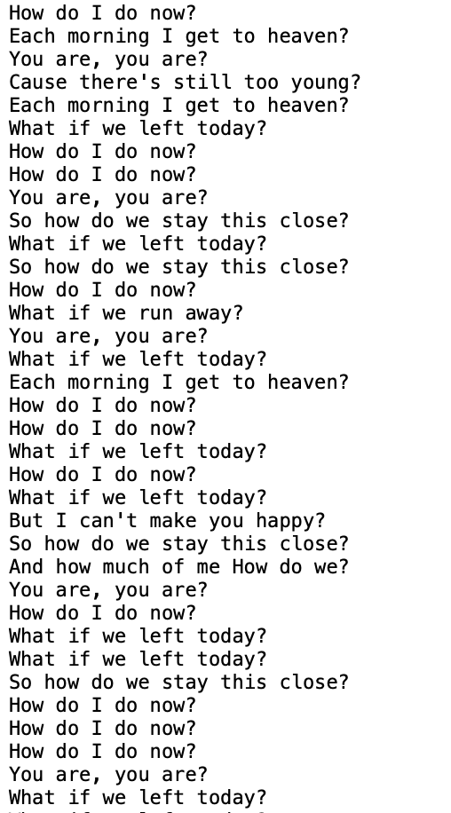
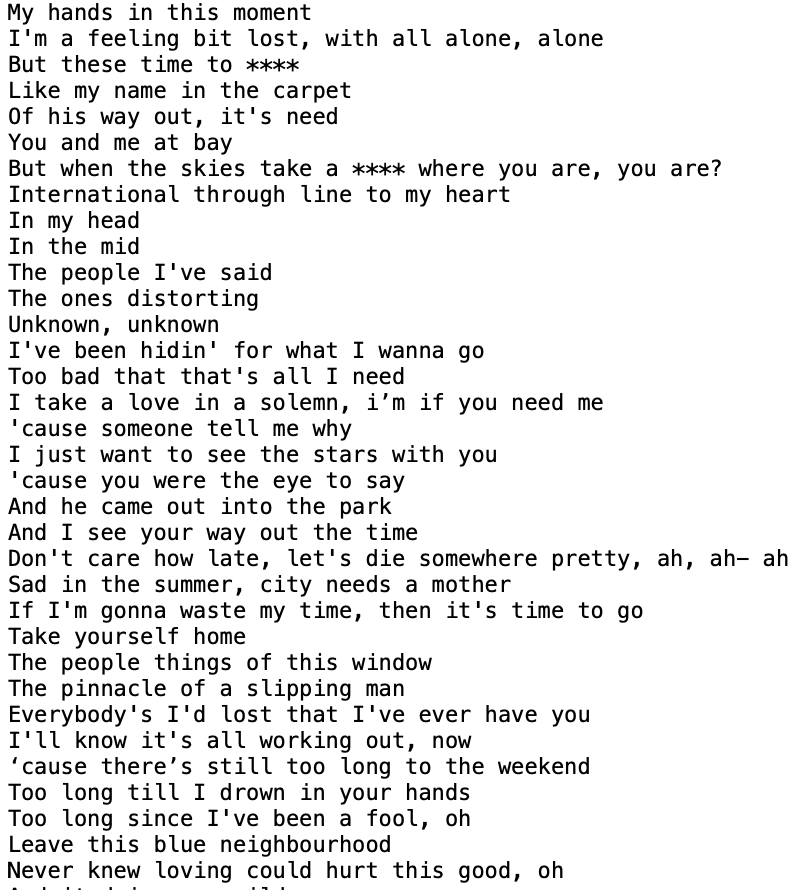

# MyNLPProject1

Code reference: https://github.com/benjelloo/RapNet 

https://github.com/vickyyyyyyy/lyrics-lstm/blob/main/preprocess.py

In the project, use ChatGPT to help understand some online sample code, and use ChatGPT to help find a solution when part of the code runs wrong.

## Generate Dataset(Genius-API)

```

crawl-preprocess-datasets.ipynb

```

This code performs the following tasks using the Genius API to retrieve lyrics for a specified artist (Troye Sivan) and saves them to local files for further analysis or use.

Pre-process the dataset to remove content that is not part of the lyrics and initially standardise the format of the text file.

## Markovify-generate-text

```

Markovify_generate.ipynb

```

This code is modified from week5.[Text generation with Markov Chains]
 
The ‘state_size’ parameter of the Markov chain in this model is set to 2, so that the generative model will consider the context of the current word and the previous word to generate the next word.

## Neural-Nets- generate-text

### 2 recurrent neural network (RNN) layers

Neural-Net

```

Neural-Net/dataprep.py

```

perform data set preprocessing, including printing of text length, processing of punctuation marks, lowercase conversion of text, segmentation of text, and mapping of characters to integer indexes.

```

Neural-Net/model.py

```


define an LSTM model.

```

Neural-Net/Neural-Nets-generate-text-2.ipynb

```


Training the model and generating lyrics, postprocessing the generated lyrics

### 3 recurrent neural network (RNN) layers

```

Neural-Net-layer3

```

Modified by Neural-Net-layer2

## Generated Lyrics

```

<New lyrics>

```

## Example predicted lyrics:

Lyrics generated from Morkov model



Lyrics generated from LSTM model

